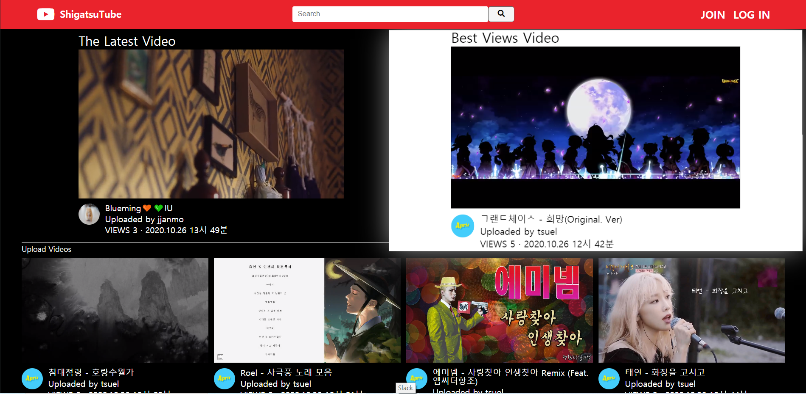
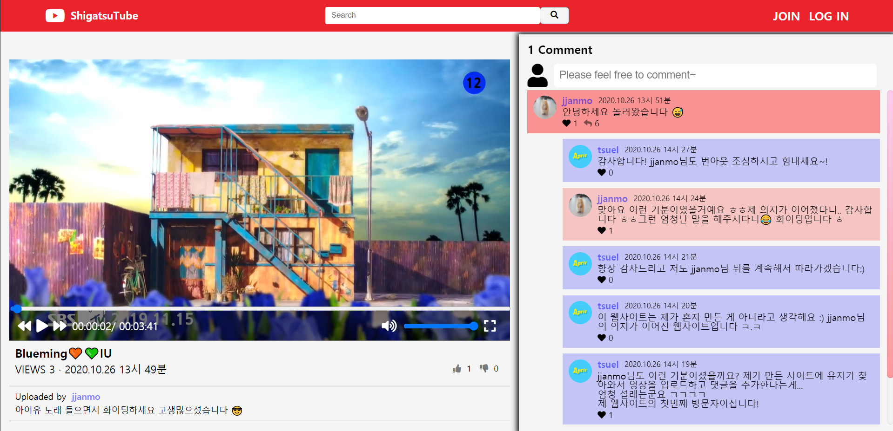
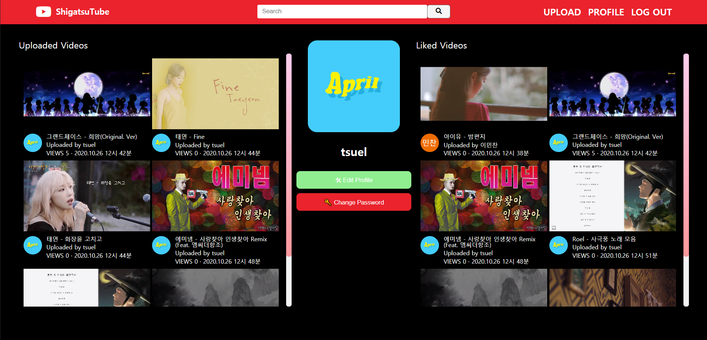

# Shigatsuel\_\_Shigatsutube

Cloning Youtube with VanillaJS and NodeJS

# Demo

[ShigatsuTube](https://enigmatic-spire-78020.herokuapp.com/)

# Preview







# Technology Stack

| Frontend |       Technology        | Where  |
| :------: | :---------------------: | :----: |
|    01    |      Pug(Template)      | views  |
|    02    |        SCSS(CSS)        | assets |
|    03    |       JavaScript        | views  |
|    04    |        AJAX(API)        | assets |
|    05    | Webpack(Module Bundler) | static |

| Backend |       Technology       |     Where      |
| :-----: | :--------------------: | :------------: |
|   01    |     NodeJS(Server)     |     app.js     |
|   02    |  ExpressJS(Framework)  |     app.js     |
|   03    |   MongoDB(DataBase)    |     db.js      |
|   04    |   Mongoose(DataBase)   |     db.js      |
|   05    | Passport(Authenticate) |  passport.js   |
|   06    |    AWS S3(Storage)     | middlewares.js |
|   07    |   Heroku(Distribute)   |  package.json  |

# Pages

- [x] Home `1️⃣The Latest Video` `2️⃣The Best View Video` `3️⃣Uploaded Videos`

- [x] Join `Local Sign Up` + `Social Sign Up`

- [x] Login `Local Sign In` + `Social Sign In`

- [x] Search

- [x] Me Detail

- [x] User Detail

- [x] Edit Profile

- [x] Change Password

- [x] Upload `You can upload single video at once` + `You can upload record video!`

- [x] Video Detail `1️⃣Like or Dislike Video` `2️⃣Comment & Reply in Realtime~` `3️⃣Comment & Reply Heart` `4️⃣Flash Message & ModalBlock`

- [x] Edit Video

# Directory Structure

```
build
node_modules
src
|-- assets
|   |-- js
|   |   |-- addComment.js
|   |   |-- addReplyComment.js
|   |   |-- deleteComment.js
|   |   |-- deleteReply.js
|   |   |-- editComment.js
|   |   |-- editReplyComment.js
|   |   |-- heartComment.js
|   |   |-- heartReplyComment.js
|   |   |-- likeVideo.js
|   |   |-- main.js
|   |   |-- modalBlock.js
|   |   |-- notificationModal.js
|   |   |-- videoBlock.js
|   |   |-- videoPlayer.js
|   |   |-- videoRecorder.js
|   |-- scss
|   |   |-- config
|   |   |   |-- _variables.scss
|   |   |   |-- reset.scss
|   |   |-- pages
|   |   |   |-- home.scss
|   |   |   |-- search.scss
|   |   |   |-- userDetail.scss
|   |   |   |-- videoDetail.scss
|   |   |-- partials
|   |   |   |-- comment.scss
|   |   |   |-- commentBlock.scss
|   |   |   |-- flashMessage.scss
|   |   |   |-- footer.scss
|   |   |   |-- form.scss
|   |   |   |-- header.scss
|   |   |   |-- modalBlock.scss
|   |   |   |-- replyBlock.scss
|   |   |   |-- socialLogin.scss
|   |   |   |-- videoPlayer.scss
|   |   |   |-- videoRecorder.scss
|   |   |-- main.scss
|   |   |-- styles.scss
|-- controllers
|   |-- commentController.js
|   |-- replyController.js
|   |-- userController.js
|   |-- videoController.js
|-- modles
|   |-- Comment.js
|   |-- Reply.js
|   |-- User.js
|   |-- Video.js
|-- routers
|   |-- apiRouter.js
|   |-- globalRouter.js
|   |-- userRouter.js
|   |-- videoRouter.js
|-- static
|   |-- main.js
|   |-- styles.js
|-- uploads
|   |-- avatars
|   |-- videos
|-- views
|   |-- layouts
|   |   |-- main.pug
|   |   |-- mainGrey.pug
|   |   |-- subMain.pug
|   |   |-- subMainBlack.pug
|   |-- mixins
|   |   |-- commentBlock.pug
|   |   |-- flashMessage.pug
|   |   |-- modalBlock.pug
|   |   |-- replyBlock.pug
|   |   |-- videoBlock.pug
|   |   |-- videoPlayer.pug
|   |-- partials
|   |   |-- footer.pug
|   |   |-- footerGrey.pug
|   |   |-- header.pug
|   |   |-- socialLogin.pug
|   |-- changePassword.pug
|   |-- editProfile.pug
|   |-- editVideo.pug
|   |-- home.pug
|   |-- join.pug
|   |-- login.pug
|   |-- search.pug
|   |-- upload.pug
|   |-- userDetail.pug
|   |-- videoDetail.pug
|-- app.js
|-- db.js
|-- init.js
|-- middlewares.js
|-- passport.js
|-- routes.js
|-- webpack.config.js

```

**[⬆ Back to Top](#Shigatsuel__Shigatsutube)**

# Install and Setup

Git this repository. You will need `node` and `npm` installed globally on your device!<br><br>

1. `git clone https://github.com/ShigatsuEl/shigatsutube-clone.git`

2. `npm install`

If you are Window user, you need to change a few more

1. Go to pakage.json and fixed `"script": {"prebuild": "rm -rf build"}` -> `"script": {"prebuild": " rd /s /q build"}`

2. Go to pakage.json and fixed `"script": {"copyAll": "cp -R src/static build && cp -R src/views build"}` -> `"script": {"copyAll": "xcopy [option] src/static build && xcopy [option] src/views build"}`

# Run

To start Server:

`npm start`

# Reflection

> 프로젝트를 통해 느낀점을 정리한다.
> 글 쓰는 게 익숙치 않아서 jjanmo님의 Markup을 빌려왔다.

---

## 프로젝트 시작 2주 전

개발을 진지하게 해보고 싶은지 2주차가 끝나던 날, 코코아 클론 챌린지를 통해 HTML + CSS가 익숙해졌다고 생각했다.<br>그 때 당시만 해도 나는 프로그래밍에 소질이 있는 게 아닐까(?)하는 건방진 생각을 했다.<br>정작 프로그래밍 언어는 건드리지도 않고서.. ㅋ.ㅋ<br>HTML CSS가 프로그래밍 언어인 줄 알았던 우물 안 개구리 시절이 있었던 것 같다.<br>바닐라 JS로 크롬 앱 만들기(Momentum)을 통해 처음으로 JS에 도전했었는데 HTML CSS와는 다르게 내가 원하는 대로 만들 수가 없었다.<br>이 길이 나에게 맞는건가 생각도 했었다 ㅋㅋ<br><br>

이 길이 맞는지 아닌지 고민할 시간이 없었다.<br>바로 다다음 주면 시작하는 유튜브 클론 코딩 챌린지가 있었기 때문에 나는 어떻게든 이 챌린지를 통과하고 싶었다.<br>이번 기회를 놓치면 2달이상을 기다려야 하는 대참사가 일어난다.<br>이러한 동기 덕분에 내가 일주일 만에 JS에 관한 영상과 문서들을 읽으면서 기본적인 것만 이해할 수 있는 상태가 되었던 것 같다.<br><br>

## 프로젝트 시작 1주 전

유튜브 챌린지 시작 일주일 전, 유튜브 강의를 미리 듣기 시작했다.<br> 저번 챌린지에서 미리 들었음에도 불구하고 아슬아슬하게 제출했던 기억이 있기 때문이다.<br>그런데 유튜브 강의는 내 생각과 다르게 나에게 매우 어려웠다. 바닐라JS를 배울때와는 차원이 다른 어려움이었다.<br>서버, 데이터베이스는 내가 다뤄보게 될 줄은 생각도 못했는데 `풀스택`이 말로만 풀스택이 아니라 다하는 만큼 정말 어렵구나라는 생각이 들었다.<br>강의를 열심히 들어봤지만 벙쪄서 혼이 나간적도 있었고 이해안되는 것을 억지로 이해하려고 하니 번아웃도 심하게 왔다.<br>진짜 진짜로 이 길이 나에게 맞는지 다시 한 번 생각이 들었다.<br> 바닐라 JS가 부족하다고 생각되는 것도 아니었는데 새로운 영역에 발을 들인 느낌을 받았다.<br><br>

## 프로젝트 D-day1

챌린지 시작 하루 전, 강의 절반을 수강하였다.<br>하지만 이해한 수준은 절반도 안되는 듯 보였다.<br>이대로는 안되겠다고 생각이 들어 챌린지 시작을 하면서 강의를 처음부터 다시 듣기 시작했다.<br> 첫번째 만큼은 아니지만 강의를 다시 들으니 저번에 몰랐던 내용도 조금씩 이해하기 시작했다.<br><br>

## 프로젝트 시작 1주 차

챌린지 시작 1주 차, 개발이 주옥같이 느껴졌고 코드만 봐도 속이 답답해졌다.<br>강의 듣는 것이 귀찮아졌고 밖에 나가서 바람쐬는 일이 잦아졌다.<br>백엔드는 바로바로 눈에 결과가 보이지 않으니 뭐하고 있는지 답답함이 느껴지는 듯 했다.<br>피드백을 받기 위해 선배들의 졸업작품을 구경하러 사이트에 놀러갔다.<br>다들 괜찮게 만드셨지만 내가 호기심을 끌게 된 웹사이트는 jjanmo님 위튜브였다.<br>유튜브 강의에서도 없던 기능들이 많았다. 댓글창도 정말 유튜브 같아 보였고 이건 어떻게 만든건지 궁금한 기능들이 많았다.<br>눈팅만 하면서 나도 이렇게 만들어보고 싶다는 생각에 힘을 가지게 되었다.<br><br>

## 프로젝트 시작 2주 차

챌린지 시작 2주 차, 챌린지는 아직 퀴즈밖에 나오지 않아 그렇게 어렵진 않았다.<br>지금이 기회라고 생각해 강의 진도를 80% 가까이 미리 수강했다.<br>힘들 때마다 눈에 보이는 결과를 보러 jjanmo님의 위튜브에 가서 나는 어떻게 만들어볼까 하는 상상을 했다.<br>덕분에 내가 왜 개발을 시작하게 되었고 개발의 즐거움을 다시 리마인드 할 수 있었다.<br>눈팅만 하던 와중에 비디오에 관해 궁금한 것이 생겨 회원가입을 하고 업로드를 하게 되었다.<br>업로드를 하면 뭔가 좋은 생각이 날 것 같았지만 별다른 소득은 없었다.<br><br>

다음 날, 다시 jjanmo님 위튜브에 갔더니 내가 올린 영상에 댓글이 달려있었다.<br>처음엔 나처럼 챌린지를 진행하고 있던 유저분이 댓글을 단 줄 알았지만 닉네임을 자세히보니 웹사이트 주인분이셨다.<br>그 때 많이 지치긴 했는지 처음 뵌 분께 그 때 당시 잘 안되던 것을 푸념했던 기억이 난다<br>그런데 의외로 jjanmo님이 자신이 도와줄 수 있으면 도와주시겠다고 하셔서 염치없게도 처음 본 분께 내가 가진 모든 고민들을 털어놓았다.<br>그 때 나도 매우 지치긴 했나보다.<br><br>

## 프로젝트 시작 3주 차

jjanmo님 덕분에 Video Detail 페이지의 레이아웃을 다시 짤 수 있게 되었다.<br>덕분에 내가 원하는 짜임새가 나오게 되었고 조금씩 천천히지만 내가 원하는 대로 만들어져가는 것이 보였다.<br>처음엔 그렇게 어려웠었는데 여러번 부딪히다보니 그 이해 안가던 백엔드가 조금씩 이해되기 시작했다.<br>서버, 데이터베이스라는 말만 들으면 되게 딱딱해보였는데 프론트엔드나 백엔드나 똑같은 `자바스크립트`였을 뿐이다.<br><br>

## 프로젝트 시작 4주 차

챌린지 시작 4주 차, 물어보지 않고 스스로 해보려고 jjanmo님 깃허브 소스를 훔쳐보고 있었다.<br>그런데 아무리 봐도 이해안가는 것이 하나 생겼다.<br>프론트에서 데이터베이스의 정보를 가져와서 사용하신 것이다.<br>이게 되나 싶어서 코드를 그대로 따라 쳤다.<br>그러나 결과는 역시 나만 되지 않았다.<br>jjanmo님에게 가서 물어보았으나 부재중이신 듯하다. 4주차에 접어들면서 내가 원하는 유튜브를 만들려면 시간이 촉박하다고 생각해 다른분께 질문을 하기로했다.<br>슬랙에서 운이 좋아 Flynn님께 도움을 받게되었다.<br>위의 질문을 하자, 내가 몰랐던 부분을 찾아주셨다. 백엔드 컨트롤러에서 프론트엔드로 res.json을 통해 정보를 보낼 수 있었던 것이다.<br>따라만들기의 부작용을 그대로 받은 듯 하다.<br>내가 찾아보지 않고 남의 코드를 훔쳐보기만 하니 당연히 이런 생각을 해낼 수 없었다.<br><br>

## 프로젝트 시작 5주 차

챌린지 시작 5주 차, Flynn님과 jjanmo님의 도움 없이도 혼자서 할 수 있게 되었다.<br>`어떻게 만들지?가 아니고 어떻게 만들까?로 생각이 바뀌었다.` 모르는 것이 생기면 나도 문서를 찾아보는 습관을 하게 되었다.<br>아무리 어려운 것도 키워드를 잘 잡고 공식 문서를 뒤지거나 구글링을 하면 다 나온다는 결론을 얻었다.<br>그 뒤부터는 날개 달린듯이 개발속도가 붙기 시작했다.<br><br>

## 프로젝트 시작 6주 차

챌린지 시작 6주 차, 추가하고 싶은 기능은 계속 늘어나는데 시간이 점점 촉박해져가기 시작했다.<br>게다가 설상가상으로 챌린지 종료일이 일요일까지가 아닌 금요일까지였다는 것을 종료 2일 전에 알게되었다.<br>남은 기능을 포기하고 배포부터 먼저하는 작업을 했다.<br>내가 먼저해보고 다른 분들께 묻는게 정석이지만 지금은 시간이 없어 그런 것을 따질 처지가 아닌 것 같았다.<br>슬랙에서 Kangdyu님을 통해 도움을 부탁드렸다.<br>덕분에 챌린지 종료 하루 전에 아슬아슬하게 제출할 수 있었다.<br><br>

제출 후에도 Flash Message / Modal등을 더 추가했다.<br>다 만들고 보니 이걸 내가 만들었다는 것이 믿기지 않았다.<br>분명 한달 반 전만해도 번아웃도 많이오고 이 길이 나게에 맏는지 의심을 했었는데 `포기하지 않고 끝까지 달려오니 코딩이 재미있어졌다.`<br>지금은 프론트엔드 백엔드 가릴 것 없이 매우 재미를 느끼게 되었다.<br>또한 앞으로 더 다양한 프레임워크와 라이브러리를 다뤄보고 싶게 되었다.<br>이 모든 것이 나 혼자였으면 불가능했을 것이라고 생각한다.<br>
나도 앞으로 누군가를 도와줄 정도로 훌륭한 개발자가 될 수 있을까..?<br><br>

```
도와주신 `Flynn님` `JJanmo님` `Kangdyu님`께 너무 감사드리며 느낀점을 정리합니다.
같이 끝까지 챌린지를 달려오신 분들께 축하를 드립니다.

ShigatsuTube 소스를 통해 궁금한 점이 생기면 언제든지 질문을 넣어주시길 바랍니다 :)
```

**[⬆ Back to Top](#Shigatsuel__Shigatsutube)**

# Improvement

> 개선해야할 부분들<br>
> 부족한 부분들을 중점으로 다뤄본다.

## Dependant

jjanmo님 깃헙소스를 보면서 혼자서 다 찾아보고 만들어보셨다는 것이 대단하다고 느껴졌다.<br>그 분과 나의 차이점은 스스로 만들어봤는지 아니면 남의 코드를 갖다 배꼈는지의 차이이다.<br>물론 나도 막 갖다 붙이진 않았다.<br>코드가 어디서 어떻게 사용되는지를 이해하고 필요한 부분에 갖다쓰고 필요하면 내가 더 추가를 했지만 그게 중요한 것이 아니다.<br>나 역시 jjanmo님처럼 빠르게 성장하려면 생각한 것을 스스로 만들어보는 것이 중요하다고 생각하기 때문에 그런의미로 이번에 유튜브 프로젝트를 진행하면서 내 스스로 만들었다고 말할 수 없다고 본다.<br>`다음 프로젝트는 꼭 한가지 방법으로만 진행하지말고 내가 해봐야겠다고 생각한 것들을 문서에서 직접 찾으면서 만들기 바란다.`

## Overlap

위와 같은 문제지만 시간이 부족한 관계로 진정으로 나 혼자서 유튜브를 만들어봤다고 할 수 없기 때문에 코드가 중복되어있는 경우가 상당히 많다.<br> 예를 들어 Comment중에서 owner과 visitor을 나루려면 문서에서 잘 찾아보면 pug if문을 통해 짧게 해결할 수 있었을 것이다.<br>또한 SCSS 역시 중복되는 부분만 따로 설정해줬으면 됐는데 찾아보는 게 귀찮아 중복된 코드를 쓰게 되었다.<br>이러한 이유 때문에 코드가 상당히 지저분하고 길어지는 문제점이 생기게 되었다.

## Portrait Video

그리드를 사용하면서 세로 동영상을 마치 가로 동영상처럼 만드는 방법을 찾지 못했다.<br>백엔드에서 세로 동영상을 막는 방법을 미들웨어나 컨트롤러에서 Multer limits로 제한하려 했으나 좋지 않은 방법인 것 같아 포기했다.<br>이 부분만 고쳤다면 내가 원한 유튜브 형태가 되었을 것 같다.

## Server Build

시간이 부족해서 하루만에 서버 배포를 해버렸다.<br>과정은 다 기억나지만 왜 그렇게 해야되는지에 대해 제대로 짚고 넘어가지 못했다.<br>

**[⬆ Back to Top](#Shigatsuel__Shigatsutube)**

# Move Forward

## JavaScript30

이번 유튜브 챌린지를 통해 자바스크립트를 정말로 많이 배웠다고 생각은 하지만 기본적인 것에 대해서는 아직 많이 부족하다고 생각한다.<br>따라서 Wesbos의 [JavaScript30])(https://javascript30.com/) 챌린지를 통해 JS의 기초를 더 쌓을 생각이다.

## 33 Concepts every JavaScript developer should know

면접에서 호이스팅이 뭐냐 Promise가 어떤 역할이냐 같은 질문에 대답도 못하면 말이 안된다고 생각한다.<br> 이 자바스크립트 33가지 개념은 필수는 아니지만 내가 자바스크립트가 어떻게 작동하는지 더 깊게 이해할 수 있게 도와줄 초석이 되어줄 거라 믿는다.<br>
[33 Concepts every JavaScript developer should know](https://github.com/yjs03057/33-js-concepts)

## Dream Coding JS Foundation

위의 33가지 개념과 같이 하면 좋을 것 같다는 생각이 들어 추가했다.<br>
1주 정도의 기간을 갖고 완주하는 것을 목표로 하고 있으며 완주하는 후로 JavaScript30 챌린지에 도전할 생각이다.<br>

# Finally

개발자는 아무나 될 수 없다는 것을 유튜브 챌린지를 통해 실감했다.<br>
과정이 매우 어려운 것은 사실이나 포기하지 않고 끝까지 하게된다면 언젠가 그 빛을 보게 될 것이다.<br>어떤 어려움이 닥쳐와도 절대 포기하지 않고 노력한다면 분명 언젠가는 코딩을 즐길 수 있다고 믿는다 :) <br><br>
